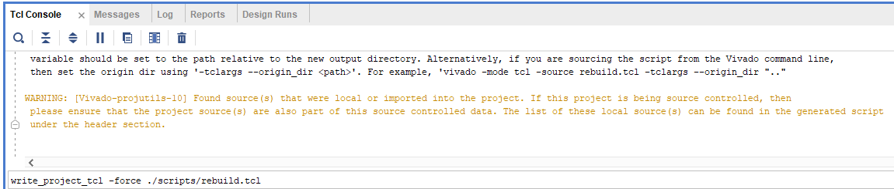

# Open Source FPGA Gameboy Emulator

## Get started
### Generate Vivado Project
- Open command line from this directory and run the following:
  ```
  vivado -source scripts/rebuild.tcl
  ```
  - This will launch and rebuild the Vivado project using the files in this repo.

### Update Build Script
Inside of Vivado IDE, do the following to regenerate the build script:
- Run the following command in the TCL Console:
  ```
  write_project_tcl -force ./scripts/rebuild.tcl
  ```
  